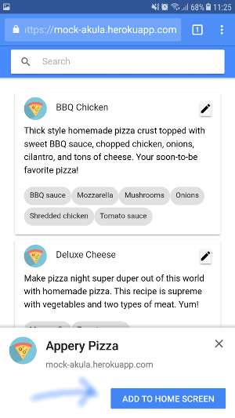
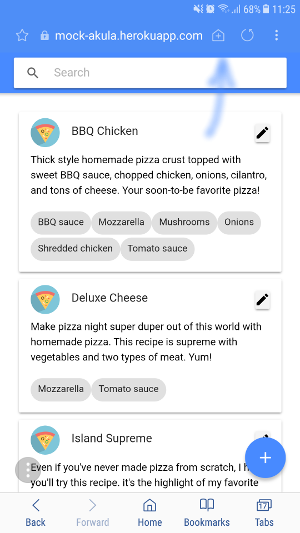
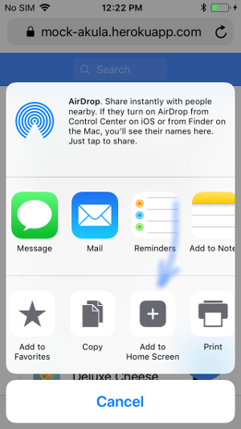

# PWA Pizza

Example of Ionic 3 Progressive Web Application that performs
Create-Read-Update functions for Appery.io database.

Deployed at https://pizza-pwa.app.appery.io

Intended to check PWA capabilites on different mobile devices/browsers.

To build:

```
npm run ionic:build -- --prod
```

## Android

### Adding icon to Home screen

- "Add to Home Screen" button appears in Chrome



- Samsung Internet browser has a button in title bar that allows
adding the app icon to Home screen



One can add app icon to Home screen twice: from Chrome and from Samsung Internet browser.

### Fullscreen mode

App icon on Home screen made by Chrome opens app in fullscreen properly.

App icon made by Samsung Internet browser opens app with URL still visible in title bar.

### Offline mode

This demo implements the simplest strategy for offline mode:
GET requests used to read data from ApperyDB are coming from cache and available in offline mode.
POST requests to update DB return an error.

This is true for both Chrome and Samsung Internet browser.

## iOS

iOS added some PWA support since version 11.3, but there were still some issues.
We tested it against recent iOS version available at the moment which is 11.4.1

### Adding icon to Home screen

- To add app icon to Home screen one should click "Share" icon in Safari,
then "Add to home screen"



### Fullscreen mode

URL in title bar is not visible when app is opened using Home screen icon.

### Offline mode

When app is started in airplane mode it asks for Wi-Fi to be turned on, so offline mode is essentially not working.

